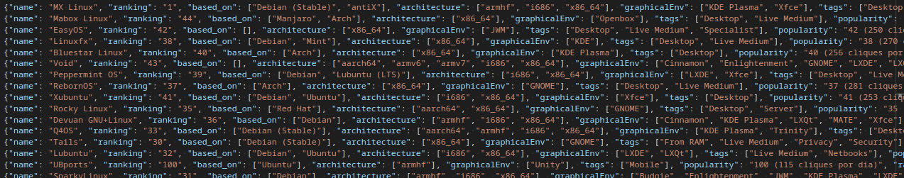

# Distros Scraping

Este scraper tem como finalidade buscar informações a respeito das 100 distribuições Linux/BSD mais populares da atualidade. Para tal, será feita uma raspagem de dados no https://distrowatch.com/, um observatório das distribuições Linux e BSD mantido desde 2001.

As informações a serem coletadas de cada distribuição são:
- Nome da distribuição
- Posição no ranking
- Em quais sistemas a distro é baseada
- Arquiteturas compatíveis. Exemplos: armhf, i686, x86_64 
- Ambientes gráficos. Exemplos: KDE Plasma, Xfce, Cinnamon
- Tags. Exemplos: Desktop, Server, Raspberry Pi, Security 
- Popularidade 
- Avaliação

A saída é um arquivo JSON

